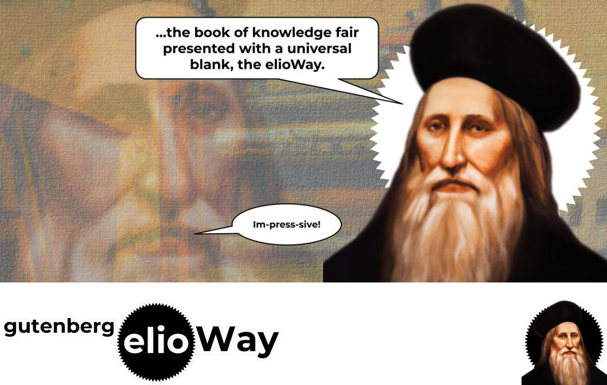

# gutenberg

Download and read Gutenberg's Public Domain books, the elioWay.

- [gutenberg Documentation](./doc/index.md)

## Seeing is Believing

```
cd ~/Dev/theelioway/gutenberg
```

- [gutenberg Quickstart](./quickstart.md)

## Prerequisites

- [gutenberg Prerequisites](./prerequisites.md)

## Installing

- [Installing gutenberg](./installing.md)

# Credits

- [gutenberg Credits](./credits.md)

## License

[MIT](license)


